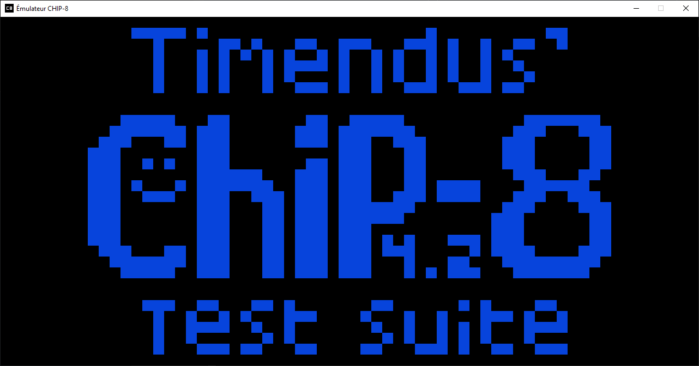
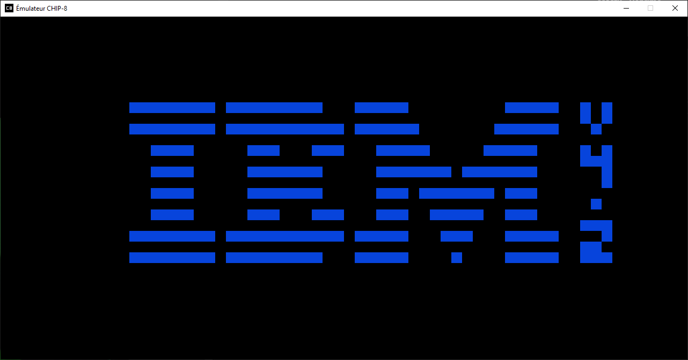
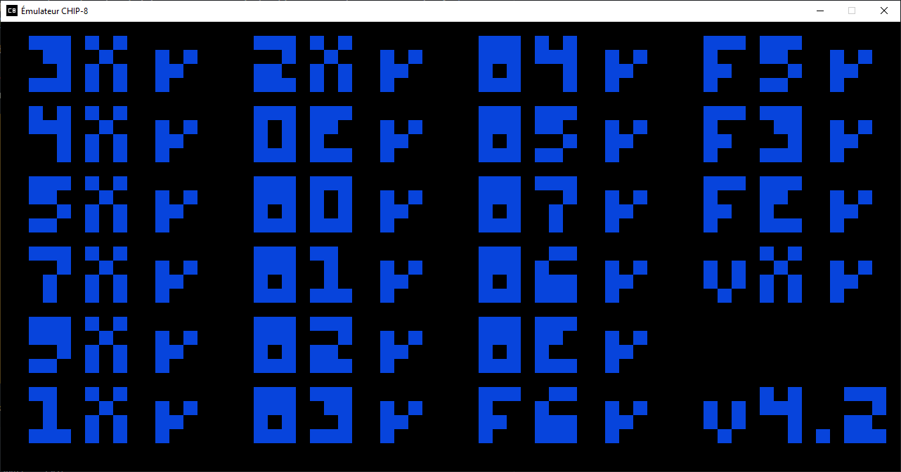
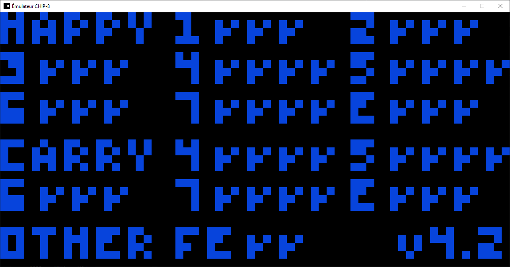
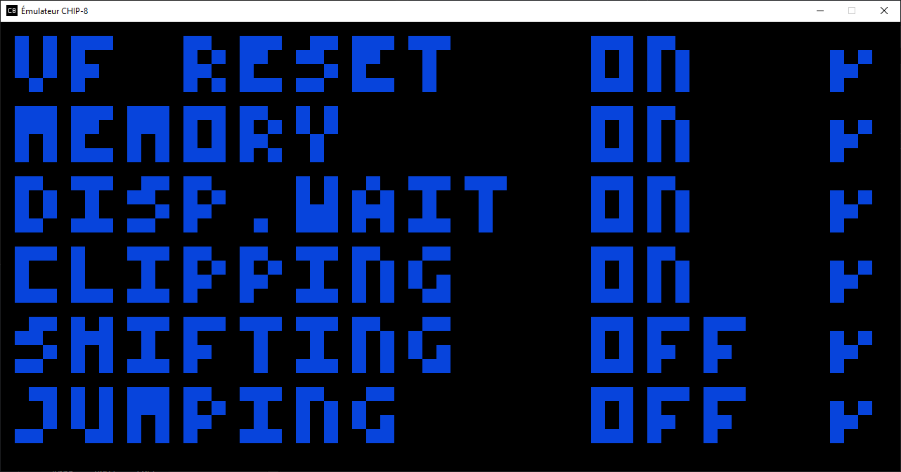
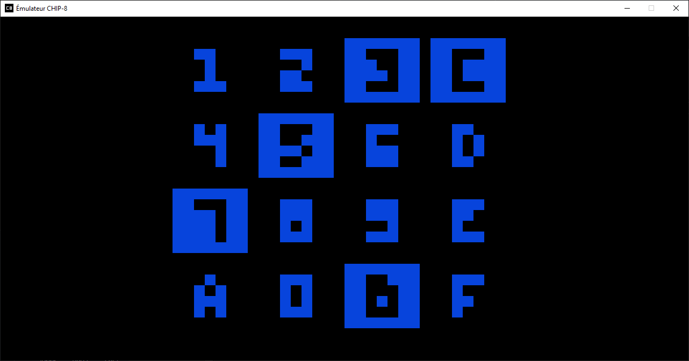
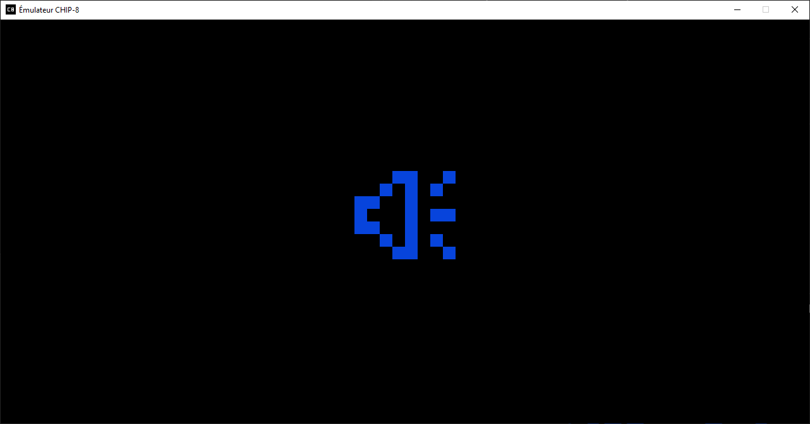

Émulateur CHIP-8, B.A.-BA du dev de l'émulation, ressources utilisées :
```
http://devernay.free.fr/hacks/chip8/C8TECH10.HTM
https://chip-8.github.io/links/
https://tobiasvl.github.io/blog/write-a-chip-8-emulator/
https://github.com/Timendus/chip8-test-suite/releases/tag/v4.2
https://www.reddit.com/r/EmuDev/comments/1ekpypf/comment/lgm8mwk/
https://nachtimwald.com/2024/03/12/chip8-dev-challenge-sound/
```

### Suite de tests

- CHIP-8 splash screen ✅
- IBM logo ✅
- Corax+ opcode test ✅
- Flags test ✅
- Quirks test ✅
- Keypad test ✅
- Beep test ✅








